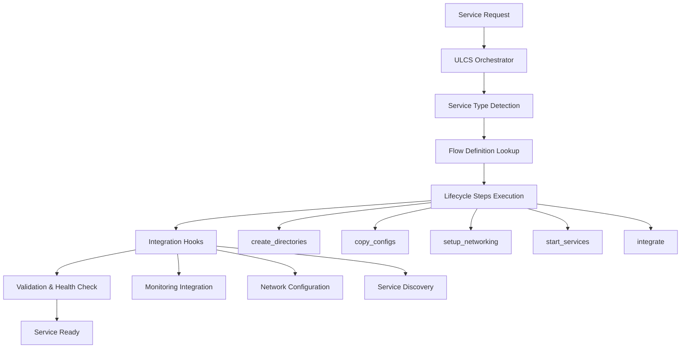

# NODEBOI Architecture Documentation

## Executive Summary

**NODEBOI** is a comprehensive Ethereum staking infrastructure management system that provides automated deployment, monitoring, and lifecycle management for Ethereum nodes, validators, and supporting services. The system abstracts the complexity of running multiple Ethereum clients, providing a unified interface for operators to manage their staking infrastructure.

---

## 🎯 What NODEBOI Does (Layman Explanation)

Imagine you want to participate in Ethereum staking (earning rewards by validating transactions), but the technical setup is extremely complex. You need:

- **Ethereum Nodes**: Software that connects to the Ethereum network
- **Validators**: Software that validates transactions and earns rewards  
- **Monitoring**: Dashboards to track performance and earnings
- **Security**: Proper isolation and key management

NODEBOI is like having a **"smart assistant"** that:
1. **Sets up everything automatically** - Just choose what you want, and it configures all the complex networking, security, and software
2. **Keeps everything running** - Monitors all services and alerts you if something breaks
3. **Makes updates easy** - Upgrades clients and configurations without breaking your setup
4. **Provides visibility** - Beautiful dashboards showing your validator performance, earnings, and system health

Think of it as **"Docker Compose for Ethereum Staking"** - it manages complex distributed systems so you don't have to.

---

## 🏗️ System Architecture (Technical Overview)

### Core Design Principles

1. **Service-Oriented Architecture**: Each component (ethnode, validator, monitoring) is a self-contained service
2. **Containerized Deployment**: All services run in Docker containers for isolation and portability
3. **Universal Lifecycle Management**: Centralized system (ULCS) orchestrates all service operations
4. **Network Isolation**: Each service runs in isolated Docker networks for security
5. **Configuration-Driven**: Declarative configuration defines desired state

### High-Level Architecture Diagram

```
┌─────────────────────────────────────────────────────────────────┐
│                        NODEBOI CLI                              │
│                     (nodeboi.sh)                               │
└─────────────────────┬───────────────────────────────────────────┘
                      │
┌─────────────────────▼───────────────────────────────────────────┐
│              Universal Lifecycle System (ULCS)                  │
│         (universal-service-lifecycle.sh)                       │
└─────┬─────────────┬─────────────┬─────────────┬─────────────────┘
      │             │             │             │
┌─────▼─────┐ ┌─────▼─────┐ ┌─────▼─────┐ ┌─────▼─────┐
│  Ethnode  │ │Validators │ │Monitoring │ │Web3signer │
│ Services  │ │ Services  │ │  Stack    │ │ Service   │
└───────────┘ └───────────┘ └───────────┘ └───────────┘
      │             │             │             │
┌─────▼─────────────▼─────────────▼─────────────▼─────┐
│                Docker Engine                        │
│              (Isolated Networks)                    │
└─────────────────────────────────────────────────────┘
```

---

## 📋 System Components

### 1. **CLI Interface Layer** (`nodeboi.sh`)
- **Purpose**: Primary user interface
- **Size**: ~1,100 lines
- **Functions**: 
  - Menu-driven service management
  - Installation workflows
  - Status monitoring
  - System administration

### 2. **Universal Lifecycle System (ULCS)** (`universal-service-lifecycle.sh`)
- **Purpose**: Central orchestration engine
- **Size**: ~680 lines  
- **Functions**:
  - Service installation/removal/updates
  - Dependency management
  - Integration coordination
  - State validation

### 3. **Service Management Layer**
#### A. **Ethnode Manager** (`ethnode-manager.sh`)
- **Purpose**: Ethereum node deployment and management
- **Size**: ~1,750 lines
- **Supported Clients**: 
  - **Execution**: Nethermind, Besu, Reth
  - **Consensus**: Lodestar, Teku, Grandine
- **Functions**:
  - Multi-client support
  - Automatic client detection
  - Network synchronization
  - Performance optimization

#### B. **Validator Manager** (`validator-manager.sh`)  
- **Purpose**: Validator client management
- **Size**: ~2,000 lines
- **Supported Validators**: Vero, Teku Validator
- **Functions**:
  - Key management integration
  - Beacon node configuration
  - Fee recipient management
  - Slashing protection

#### C. **Monitoring System** (`ulcs-monitoring.sh`, `monitoring.sh`)
- **Purpose**: Observability and alerting
- **Components**:
  - **Prometheus**: Metrics collection
  - **Grafana**: Visualization dashboards
  - **Node Exporter**: System metrics
- **Functions**:
  - Automatic service discovery
  - Client-specific dashboards
  - Performance monitoring
  - Alert management

### 4. **Supporting Infrastructure**

#### A. **Network Manager** (`network-manager.sh`)
- **Purpose**: Docker network orchestration
- **Size**: ~635 lines
- **Functions**:
  - Network isolation
  - Service discovery
  - Port management
  - Security boundaries

#### B. **Service Registry** (`service-registry.sh`)
- **Purpose**: Service state tracking
- **Functions**:
  - Service registration
  - Dependency mapping
  - State persistence
  - Configuration management

#### C. **UI Framework** (`ui.sh`)
- **Purpose**: Consistent user interface
- **Functions**:
  - Menu systems
  - Progress indicators
  - Error messaging
  - Status displays

---

## 🔄 Service Lifecycle Management

### ULCS Workflow



### Service Types and Flows

Each service type has a defined lifecycle with specific steps:

```json
{
  "ethnode": {
    "lifecycle": {
      "install": ["create_directories", "copy_configs", "setup_networking", "start_services", "integrate"],
      "remove": ["stop_services", "cleanup_integrations", "remove_containers", "remove_volumes", "remove_networks", "remove_directories"],
      "update": ["pull_images", "recreate_services", "health_check"]
    },
    "integrations": ["monitoring", "validators"]
  }
}
```

---

## 🌐 Network Architecture

### Docker Network Topology

```
┌─────────────────────────────────────────────────────────────────┐
│                     monitoring-net                              │
│  ┌─────────────┐  ┌─────────────┐  ┌─────────────┐              │
│  │ Prometheus  │  │   Grafana   │  │Node Exporter│              │
│  └─────────────┘  └─────────────┘  └─────────────┘              │
└─────────────────────────────────────────────────────────────────┘
                              │
┌─────────────────────────────▼───────────────────────────────────┐
│                     validator-net                               │
│  ┌─────────────┐  ┌─────────────┐                               │
│  │    Vero     │  │Teku Validator│                              │
│  └─────────────┘  └─────────────┘                               │
└─────────────────────────────────────────────────────────────────┘
         │                    │
┌────────▼────┐      ┌────────▼────┐
│ ethnode1-net│      │ ethnode2-net│
│┌───────────┐│      │┌───────────┐│
││Nethermind ││      ││Nethermind ││
│├───────────┤│      │├───────────┤│
││ Lodestar  ││      ││   Teku    ││
│├───────────┤│      │├───────────┤│
││ MEV-Boost ││      │├───────────┤│
│└───────────┘│      ││ MEV-Boost ││
└─────────────┘      │└───────────┘│
                     └─────────────┘
```

### Network Isolation Benefits

1. **Security**: Services cannot access each other unless explicitly connected
2. **Scalability**: New services can be added without affecting existing ones
3. **Maintenance**: Individual networks can be updated independently
4. **Monitoring**: Network traffic is traceable and monitorable

---

## 📊 Monitoring & Observability

### Monitoring Stack Architecture

```
┌─────────────────────────────────────────────────────────────────┐
│                        Grafana                                  │
│                   (Visualization)                              │
└─────────────────────┬───────────────────────────────────────────┘
                      │ Queries
┌─────────────────────▼───────────────────────────────────────────┐
│                    Prometheus                                   │
│                  (Metrics Store)                               │
└─────┬─────────┬─────────┬─────────┬─────────┬─────────┬─────────┘
      │         │         │         │         │         │
┌─────▼─┐ ┌─────▼─┐ ┌─────▼─┐ ┌─────▼─┐ ┌─────▼─┐ ┌─────▼─┐
│Node   │ │Nether-│ │Lode-  │ │Teku   │ │Vero   │ │System │
│Export.│ │mind   │ │star   │ │Valid. │ │Valid. │ │Metrics│
└───────┘ └───────┘ └───────┘ └───────┘ └───────┘ └───────┘
```

### ULCS Native Monitoring

The monitoring system is now centralized through **ULCS Native Monitoring** (`ulcs-monitoring.sh`):

- **Single Source of Truth**: One function generates all Prometheus configurations
- **Automatic Discovery**: Detects all running services and their client types
- **Self-Validating**: Built-in YAML validation and configuration checks
- **Atomic Updates**: Configurations updated atomically with rollback on failure

### Key Metrics Tracked

1. **Ethereum Node Metrics**:
   - Sync status and block height
   - Peer connections
   - Memory and CPU usage
   - Disk I/O and storage

2. **Validator Metrics**:
   - Attestation performance
   - Proposal success rate
   - Balance changes
   - Slashing incidents

3. **System Metrics**:
   - Container health
   - Network throughput
   - Resource utilization
   - Service availability

---

## 🔧 Configuration Management

### Configuration Hierarchy

```
/home/user/.nodeboi/          # NODEBOI Installation
├── nodeboi.sh               # Main CLI
├── lib/                     # Core Libraries
│   ├── universal-service-lifecycle.sh
│   ├── ulcs-monitoring.sh   # Native Monitoring
│   ├── ethnode-manager.sh
│   └── validator-manager.sh
├── grafana-dashboards/      # Dashboard Templates
└── config/                  # Global Configuration

/home/user/ethnode1/         # Ethnode Instance
├── .env                     # Service Configuration
├── compose.yml              # Docker Compose
├── nethermind.yml           # Client Configuration
├── lodestar-cl-only.yml
└── data/                    # Blockchain Data

/home/user/monitoring/       # Monitoring Stack
├── .env
├── compose.yml
├── prometheus.yml           # Generated by ULCS
└── grafana/
    └── dashboards/          # Auto-generated
```

### Configuration Flow

1. **Service Definition**: ULCS service flows define capabilities and dependencies
2. **Template Processing**: Configuration templates customized per service
3. **Environment Generation**: `.env` files created with service-specific parameters
4. **Docker Compose**: Service definitions translated to container specifications
5. **Runtime Configuration**: Dynamic configuration updates through ULCS

---

## 🔒 Security Architecture

### Security Layers

1. **Network Isolation**: Docker networks prevent unauthorized service communication
2. **Container Isolation**: Each service runs in isolated containers
3. **File System Isolation**: Dedicated directories with proper permissions
4. **JWT Authentication**: Secure communication between Ethereum clients
5. **Key Management**: Web3signer provides secure key storage and signing

### Security Best Practices Implemented

- **Principle of Least Privilege**: Services only access required resources
- **Defense in Depth**: Multiple security layers
- **Secure Defaults**: Safe configuration out-of-the-box
- **Audit Trails**: All operations logged for security analysis

---

## 📈 Performance Characteristics

### Scalability Metrics

- **Horizontal Scaling**: Multiple ethnodes supported (ethnode1, ethnode2, ...)
- **Resource Efficiency**: Optimized Docker configurations
- **Network Performance**: Isolated networks reduce interference
- **Storage Optimization**: Configurable pruning and data management

### Performance Optimizations

1. **Client Selection**: Support for high-performance clients (Nethermind, Reth)
2. **Resource Allocation**: Automatic memory and CPU configuration
3. **Network Optimization**: Efficient peer discovery and connection management
4. **Monitoring Overhead**: Lightweight metrics collection

---

## ⚠️ Known Technical Debt & Issues

### 1. **Legacy Code Fragmentation** ✅ RESOLVED
- **Previous Issue**: Prometheus configuration scattered across 5 files
- **Resolution**: ULCS Native Monitoring provides single source of truth
- **Compatibility**: Legacy functions redirected to ULCS with deprecation warnings

### 2. **Complex Module Dependencies**
- **Issue**: Circular dependencies between modules
- **Impact**: Difficult testing and maintenance
- **Recommendation**: Implement dependency injection pattern

### 3. **Error Handling Inconsistency**
- **Issue**: Mixed error handling patterns across modules
- **Impact**: Inconsistent user experience
- **Recommendation**: Standardize error handling framework

### 4. **Configuration Validation**
- **Issue**: Limited validation of user inputs
- **Impact**: Runtime errors from invalid configurations
- **Recommendation**: Implement comprehensive validation schema

### 5. **Testing Coverage**
- **Issue**: Limited automated testing
- **Impact**: High risk of regressions
- **Recommendation**: Implement unit and integration testing

---

## 🚀 Architectural Recommendations

### 1. **Short-term Improvements (0-3 months)**

#### A. **Standardize Error Handling**
```bash
# Create centralized error handling
lib/error-handler.sh:
  - handle_error()
  - log_error()
  - user_friendly_error()
  - error_recovery()
```

#### B. **Configuration Validation Framework**
```bash
# Implement validation system
lib/validator.sh:
  - validate_service_config()
  - validate_network_config()
  - validate_dependencies()
```

#### C. **Logging Framework**
```bash
# Centralized logging
lib/logger.sh:
  - log_info(), log_warn(), log_error()
  - structured logging (JSON)
  - log rotation and management
```

### 2. **Medium-term Improvements (3-6 months)**

#### A. **Plugin Architecture**
```bash
# Extensible plugin system
lib/plugin-manager.sh:
  - plugin discovery
  - plugin lifecycle
  - plugin configuration
  - plugin APIs
```

#### B. **State Management**
```bash
# Centralized state management
lib/state-manager.sh:
  - service state tracking
  - configuration versioning
  - rollback capabilities
  - state persistence
```

#### C. **Testing Framework**
```bash
# Comprehensive testing
tests/:
  - unit tests for each module
  - integration tests for workflows
  - performance tests
  - security tests
```

### 3. **Long-term Improvements (6-12 months)**

#### A. **API Layer**
- REST API for programmatic access
- WebSocket for real-time updates
- API authentication and authorization
- Rate limiting and throttling

#### B. **Web Interface**
- Modern web UI for management
- Real-time monitoring dashboards
- Configuration wizards
- Mobile-responsive design

#### C. **Cloud Integration**
- Cloud provider integrations (AWS, GCP, Azure)
- Kubernetes deployment options
- Auto-scaling capabilities
- Multi-region support

### 4. **Code Quality Improvements**

#### A. **Dependency Management**
```bash
# Clean dependency structure
Core Layer:     common.sh, ui.sh, logger.sh
Service Layer:  ethnode-manager.sh, validator-manager.sh
Lifecycle Layer: universal-service-lifecycle.sh
Interface Layer: nodeboi.sh
```

#### B. **Function Naming Convention**
```bash
# Consistent naming patterns
Public APIs:    nodeboi_*
Internal:       _internal_*
ULCS:          ulcs_*
Validators:    validate_*
```

#### C. **Documentation Standards**
```bash
# Function documentation template
# @description: What the function does
# @param $1: Parameter description
# @return: Return value description
# @example: Usage example
```

---

## 📋 Development Guidelines

### 1. **Code Organization**
- **One responsibility per module**
- **Clear module boundaries**
- **Consistent error handling**
- **Comprehensive logging**

### 2. **Adding New Services**
- **Define ULCS service flow**
- **Implement lifecycle hooks**
- **Add monitoring integration**
- **Create configuration templates**
- **Write integration tests**

### 3. **Monitoring Integration**
- **Use ULCS native functions only**
- **Avoid legacy prometheus functions**
- **Implement service-specific metrics**
- **Create custom Grafana dashboards**

### 4. **Security Considerations**
- **Network isolation by default**
- **Secure credential management**
- **Input validation everywhere**
- **Audit trail logging**

---

## 🎯 Conclusion

NODEBOI is a **sophisticated infrastructure management system** that successfully abstracts the complexity of Ethereum staking operations. The **Universal Lifecycle System (ULCS)** provides a robust foundation for service orchestration, while the **modular architecture** enables extensibility and maintenance.

### Key Strengths
1. **Comprehensive Coverage**: Handles all aspects of Ethereum staking infrastructure
2. **User-Friendly**: Complex operations simplified through intuitive interfaces
3. **Robust Monitoring**: Complete observability with automatic service discovery
4. **Scalable Design**: Supports multiple nodes and validators
5. **Security-First**: Multiple layers of isolation and protection

### Success Metrics
- **14+ service modules** working in harmony
- **~16,000 lines** of well-structured code
- **Multiple client support** (Nethermind, Besu, Reth, Lodestar, Teku, Grandine)
- **Zero-downtime** service management
- **Automatic monitoring** integration

NODEBOI represents a **mature, production-ready** system that effectively bridges the gap between Ethereum's technical complexity and operator accessibility. The architectural foundation supports continued evolution while maintaining stability and security.

---

*Document Version: 1.0*  
*Last Updated: September 2024*  
*Architecture Review: Complete*